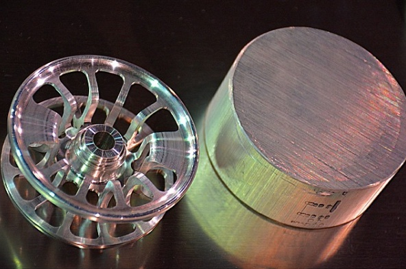
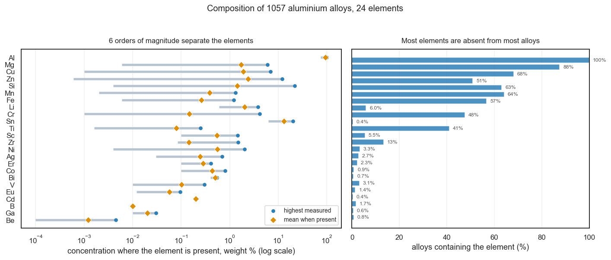
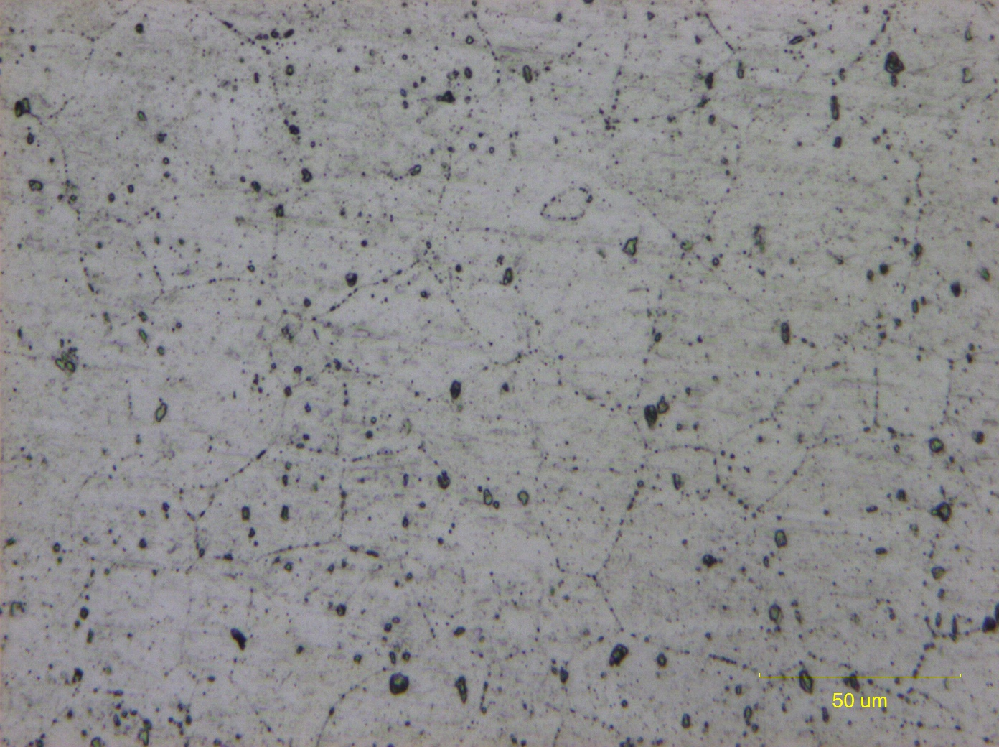

# Exploring Structure in Data: Aluminium Alloys and PCA


*A fly reel spool and the billet of bar stock it was machined from — both the same
alloy, **6061**. Photograph by Nexus65, licensed
[CC BY-SA 4.0](https://creativecommons.org/licenses/by-sa/4.0/), via
[Wikimedia Commons](https://commons.wikimedia.org/wiki/File:Machining_Process_of_a_fly_reel_spool.png).*

That alloy is in the dataset you are about to explore — **36 times**. Here is one
of them:

```
Al 97.95%   Mg 1.00%   Si 0.60%   Cu 0.25%   Cr 0.20%
```

Almost pure aluminium, with one percent magnesium and half a percent silicon
doing the work. Those two additions are what make it *6061*: in the standard
designation system, the 6xxx series is the magnesium-and-silicon family. Every
figure above sits inside the published specification for 6061 — and close to the
middle of it.

6061 is among the most widely used alloys there is: aircraft structures, bicycle
frames, yacht fittings, scuba tanks — and fishing reels, which is how the spool
in the photograph came to be made of it.

Hold on to one detail from that photograph. The billet and the finished spool are
the same metal, but they are not in the same *condition* — machining, and the
heat treatment that follows it, change the alloy's strength without changing a
single number in the composition above. The dataset records that separately, and
what PCA can and cannot do with it is the most interesting question in this
tutorial.

## Background: a century of alloys, collected into one table

Aluminium is almost never used pure. Add a little copper and it hardens; add
zinc and magnesium and it becomes strong enough for aircraft; add silicon and it
flows into a mould without cracking. Around the base metal, a century of
metallurgy has grown a catalogue of thousands of named alloys, each a recipe of
small additions to an aluminium matrix.

This dataset gathers **1057 distinct aluminium alloys** from the published
literature, each described by the weight fraction of **24 elements**, together
with the **processing condition** — the heat treatment or mechanical working the
alloy received after casting.

It was assembled by Bhat, Barnard and Birbilis (2023) for a study that asked
whether machine learning could discover the classes of aluminium alloy *without
being told them*. They used clustering and a decision tree. We are going to ask a
related question with a much simpler tool, and see how far PCA gets on its own.

---

## What makes this dataset different

Every tutorial in this series has had a lesson attached to the data's shape. This
one has three, and the first will overturn a rule you have been taught.

**The variables are parts of one whole.** Each row is a composition: the 24
fractions sum to 1. They are all the same physical quantity, measured in the same
unit, and a rise in one forces the others down as arithmetic rather than
chemistry. This is called **closed compositional data**, and it changes what
preprocessing is appropriate.

**One variable dominates completely.** Aluminium runs from **74.95% to 99.99%**,
averaging **94.34%**. Everything else is an addition around the edges. The
standard deviation of Al is **21494 times** that of beryllium.

**Three quarters of the table is zero.** 74.1% of all composition cells are
exactly zero, and **every single row contains at least one**. Most alloys contain
a handful of the 24 elements and none of the rest. Zinc is absent from 518 of the
1057 alloys; silver from 1028.

The last two are easier to see than to read:


*Left: the concentration each element reaches in the alloys that contain it, on a
logarithmic axis. Right: how many of the 1057 alloys contain it at all. Generated
by `make_composition_plot.py`.*

The left panel is split from the right on purpose. Zero in this table means "not
in this alloy", not "present in a vanishing amount", so an average taken over all
1057 rows would describe a mixture of two different statements. Asking *how much,
when present* and *how often present* separately keeps each one answerable.

### Reflect:

* On the left panel, find aluminium and beryllium. Roughly how many factors of ten
  lie between them?
* PCA looks for directions of large variance. Reading the left panel only, which
  two or three elements would you expect it to build its first component from?
* Now look at the right panel. Scandium reaches 1.45% where it appears — more than
  copper's average — but it appears in 5.5% of the alloys. Do you expect PCA to
  notice it?

👉 Six factors of ten separate the extremes, from beryllium at 0.0001% to
aluminium at 99.99%. That span is **not** an artifact of units: every column is a
weight fraction of the same whole, so one percentage point means the same thing in
every one of them. Step 1 turns on exactly this.

👉 Scandium is a genuine trace addition with large effects on the alloys that
carry it, and PCA will be blind to it. A variable absent from all but the 5.5% of
rows the figure labels contributes almost no variance, whatever it does chemically
where it is present.
Step 3 returns to this, and it is a real limitation rather than a curiosity.

| | |
|---|---|
| Samples | 1057 distinct alloys |
| Variables | 24 element concentrations (weight fractions) |
| Held out for coloring | processing type, plus alloy name, source and temper |
| Rows sum to | 1.000 (closed composition) |
| Zero cells | 74.1% |
| Concentration span | 6 orders of magnitude (0.0001% to 99.99%) |

---

# Your task: find the structure using PCA

Load `al_alloy_data.csv` into **GoPCA**. Work through the steps in order — the
first one decides whether anything that follows is meaningful.

---

## Step 1: The rule you have been taught does not apply here

> **Settings** — Row-wise: **None** · Column-wise: **Mean Center Only** · Method: **SVD** · Components: **5**

In the Wine, Corn and Body Measures tutorials, the advice was the same: the
variables are on different scales, so **standardize**. Weight in kilograms and
arm length in centimetres cannot be compared until each is divided by its own
standard deviation.

Here that advice is wrong, and it is worth understanding exactly why.

Run the analysis twice. First with **Mean Center Only**, then with **Standard
Scale (Mean + Std Dev)**. Compare the **Scree Plot** and the **Explained
Variance** panel each time.

#### Questions:

* How much variance do the first three components explain in each case?
* With standardization, how many components do you need before the cumulative
  variance becomes respectable?
* Look at the scores plot both ways. Which one has visible structure?

👉 The difference is stark:

| Preprocessing | PC1 | PC2 | PC3 | 5 PCs |
|---|---|---|---|---|
| **Mean centering only** | **59.4%** | **22.1%** | **10.3%** | **98.6%** |
| Standardization | 10.2% | 8.6% | 8.3% | 41.5% |

Mean centering gives three components carrying **92%** of the variance and a
scores plot with obvious shape. Standardization spreads the variance thinly
across two dozen directions — no component reaches 11%, and the plot is a
featureless blob.

**Why the usual advice fails.** Standardizing makes every variable contribute
equally. That is exactly right when your variables measure different things in
different units, because the units are arbitrary. It is exactly wrong here,
because the units are *not* arbitrary: all 24 columns are weight fractions of the
same whole, and a difference of one percentage point means the same thing in the
aluminium column as in the vanadium column.

Standardizing tells the analysis that beryllium — present in 8 of 1057 alloys, at
most 0.0045% — deserves the same influence as aluminium, which makes up 94% of
every sample. It does not. The large variance of aluminium is not a unit
artifact; it is the single most important fact about the data.

> **The general rule.** Standardize when your variables are incommensurable —
> different quantities, arbitrary units. Do **not** standardize when they are
> already in the same units and their relative sizes are meaningful. Spectra,
> compositions, and repeated measures of one quantity usually fall in the second
> group. GoPCA will warn you that the scales differ by 21494×; that warning is
> correct about the arithmetic and should not be obeyed here.

**Use Mean Center Only for every remaining step.**

---

## Step 2: PC1 is "how much aluminium"

> **Settings** — Column-wise: Mean Center Only · Method: SVD · Components: 5

Open the **Loadings Plot** and look at PC1.

#### Questions:

* Which element has by far the largest loading, and what sign?
* Which elements oppose it?
* What physical quantity does that contrast describe?

👉 PC1 is dominated by a single element:

```
PC1 (59.4%)    Al +0.874    Zn −0.340    Si −0.315    Cu −0.118    Mg −0.077
```

Aluminium points one way; every significant alloying addition points the other.
This is a **total alloy content** axis — or, read from the other end, a *purity*
axis. Moving along PC1 means replacing aluminium with something else.

Because the composition is closed, this component is almost forced. If the
fractions must sum to 1 and aluminium is 94% of the average sample, then the
largest thing that can vary is how much of the sample is *not* aluminium — and
whatever fills that gap must come out of the aluminium column.

Check the extremes on the **Scores Plot** with **Show labels** on:

| | Sample | Composition | Temper |
|---|---|---|---|
| PC1 most positive | 129 | **Al 100.0%** | H18 |
| PC1 most negative | 602 | Al 75.0%, **Si 22.0%**, Fe 1.1% | T5 |

At one end, commercially pure aluminium. At the other, a hypereutectic
aluminium–silicon casting alloy. PC1 has ordered the dataset from the purest
metal to the most heavily alloyed, without being told that purity is a thing.

---

## Step 3: PC2 and PC3 name the alloying system

> **Settings** — Column-wise: Mean Center Only · Method: SVD · Components: 5

If PC1 says *how much* alloying, the next components should say *what kind*. Look
at PC2, PC3 and PC4 in the **Loadings Plot**.

👉 Each one contrasts two alloying elements:

```
PC2 (22.1%)    Si +0.800    Zn −0.561    Cu −0.167
PC3 (10.3%)    Cu +0.839    Zn −0.400    Mg −0.307
PC4  (4.4%)    Mg +0.796    Zn −0.503    Si −0.225
```

PC2 sets **silicon against zinc**. PC3 brings in **copper**. PC4 brings in
**magnesium**. Between them, four components built from five elements — Al, Si,
Zn, Cu, Mg — account for **96%** of everything in the table.

#### Reflect:

* There are 24 elements. Why do four components need only five of them?

👉 Because the other nineteen barely vary. Look back at the sparsity: silver
appears in 29 alloys, beryllium in 8, gallium in 6. An element that is zero in
97% of rows contributes almost no variance, whatever its chemical importance in
the alloys that do contain it. PCA reports what *varies*, and in this dataset
what varies is the balance between aluminium and four major additions.

> **This is a real limitation, not just a curiosity.** Scandium at 1.45% or
> lithium at 3.82% transforms the alloys they appear in — Al-Li alloys were
> developed specifically for aircraft weight saving. PCA cannot see that, because
> it is looking at variance across the whole dataset and those elements are
> nearly always absent. A method that ignores rare-but-decisive variables is the
> wrong method for finding rare-but-decisive variables.

---

## Step 4: PCA rediscovers the alloy designation system

> **Settings** — Column-wise: Mean Center Only · Method: SVD · Components: 5

Aluminium alloys have been classified since the 1950s by the **Aluminium
Association** four-digit system, where the first digit names the principal
alloying element:

| Series | Principal addition |
|---|---|
| 1xxx | none — commercially pure |
| 2xxx | copper |
| 3xxx | manganese |
| 4xxx | silicon |
| 5xxx | magnesium |
| 6xxx | magnesium + silicon |
| 7xxx | zinc |

That system was built by metallurgists, by hand, over decades. Our PCA has never
heard of it. Set **Color by → `Name#category`** or read the alloy designations
with **Show labels** on, and compare where each series sits:

| Series | n | PC1 | PC2 | PC3 |
|---|---|---|---|---|
| 1xxx pure | 33 | **+0.049** | +0.006 | −0.005 |
| 3xxx Mn | 50 | +0.040 | +0.005 | −0.006 |
| 6xxx Mg+Si | 170 | +0.035 | +0.009 | −0.006 |
| 5xxx Mg | 216 | +0.026 | +0.001 | −0.012 |
| 2xxx Cu | 173 | −0.003 | −0.003 | **+0.033** |
| 7xxx Zn | 148 | −0.057 | **−0.037** | −0.013 |
| 4xxx Si | 2 | **−0.113** | **+0.095** | −0.002 |

Read it against the loadings from Step 3 and it falls into place:

* **PC1 orders the series by how much alloying they carry** — 1xxx pure at the
  top, 7xxx and 4xxx at the bottom.
* **PC2 is silicon against zinc**, and it puts **4xxx at one extreme and 7xxx at
  the other** — precisely the two series named after those elements.
* **PC3 is copper**, and **2xxx has the highest PC3 of any series**.

PCA was given nothing but 24 numbers per alloy. It recovered the axes that the
designation system is built on.

> **A caution about what this does and does not show.** The alloy series *is*
> defined by principal alloying element, so finding that a composition-based
> method recovers it is confirmation that the method works, not a discovery about
> metallurgy. The interesting part is that it emerges unsupervised and in the
> right order of importance — and that 248 of the 1057 rows carry no recoverable
> designation at all, yet sit in the same structure.

---

## Step 5: Processing type — a shift, not a separation

> **Settings** — Column-wise: Mean Center Only · Method: SVD · Components: 5

Now the question the source paper was actually about. Set
**Color by → `proc_num#category`** on the **Scores Plot**. Ten discrete colors
appear, one per processing type:

| Code | Processing type | n |
|---|---|---|
| 1 | no processing (as cast, annealed, as fabricated) | 137 |
| 2 | solutionized | 4 |
| 3 | strain hardened | 38 |
| 4 | strain hardened (hard) | 196 |
| 5 | naturally aged | 18 |
| 7 | solutionized + cold worked + naturally aged | 53 |
| 8 | solutionized + naturally aged | 77 |
| 9 | artificially aged | 21 |
| 10 | solutionized + artificially peak aged | 324 |
| 11 | solutionized + artificially over aged | 189 |

*(The codes map to the temper designations in the file — `T6` and `T651` are
type 10, `H18` and `H38` are type 4. There is no code 6 in this data.)*

#### Questions:

* Do the ten colors form ten clusters?
* Is there *any* tendency, or are the colors thoroughly mixed?

👉 **They do not separate into clusters** — and they should not be expected to.
PCA saw only composition, and a heat treatment does not change an alloy's
chemistry.

The 6061 from the opening photograph shows this exactly. One composition in the
file carries **eight different tempers**:

| Sample | 344 | 520 | 575 | 623 | 842 | 989 | 1050 | 1051 |
|---|---|---|---|---|---|---|---|---|
| Temper | O | T4 | T451 | T6 | T651 | T81 | T91 | T913 |

Annealed, naturally aged, peak aged, over aged — eight treatments spanning most of
the processing types in the table. Annealed 6061 yields at around **83–110 MPa**;
the same alloy in T6 temper yields at **240 MPa or more**. Roughly threefold the
strength, from atoms in identical proportion.

**All eight sit on the same point in the scores plot**, because all eight have the
identical 24 numbers. Turn on **Show labels** and find them.

A PCA of composition cannot distinguish them, and no amount of tuning will change
that. The information simply is not in the columns it was given.

### What actually changes, if not the composition

It is worth knowing what heat treatment does, because it explains why no
composition-based method can ever see it.

6061 is a **precipitation-hardening** alloy. Its magnesium and silicon combine
into particles of **Mg₂Si** dispersed through the aluminium matrix, and those
particles obstruct the movement of dislocations — the defects whose motion
*is* plastic deformation. Obstruct them more effectively and the metal is harder.

The heat treatments control the **size and spacing** of those particles, not how
many magnesium or silicon atoms are present:

* **O** — annealed: the precipitates are coarse and widely spaced, obstructing
  little. The metal is soft and formable.
* **T4** — solution treated, then aged at room temperature: the additions are
  dissolved into the matrix by heating, frozen there by quenching, then allowed
  to come out slowly as fine particles.
* **T6** — solution treated, then aged at elevated temperature: the same process
  driven to **peak** hardness, with the precipitates at their most effective size.
* **T651** — T6, plus stretching to relieve the internal stresses left by
  quenching.

Same atoms, same proportions, different arrangement. A composition column records
the atoms. The arrangement is microstructure, and it is simply not in the file.

Here is what that arrangement looks like:


*6061-T6, polished with colloidal silica and etched for 55 seconds in Keller's
reagent. The fine network of lines is the **grain boundaries** — the edges of
individual aluminium crystals; the dark specks are **second-phase particles**,
including Mg₂Si and iron-bearing intermetallics. Note the scale bar: the whole
field is about a quarter of a millimetre across. Photograph by Bob Clemintime,
[CC BY-SA 4.0](https://creativecommons.org/licenses/by-sa/4.0/), via
[Wikimedia Commons](https://commons.wikimedia.org/wiki/File:6061_Aluminum_Grain_Boundaries.png).*

Every feature in that picture — grain size, the distribution of particles, how the
crystals are oriented — is a property of *this piece of metal*, produced by its
thermal and mechanical history. Take the same alloy, anneal it, and the picture
changes while the composition does not.

> **And even this photograph does not show the whole answer.** The precipitates
> that actually make T6 strong are a few nanometres across — far below what an
> optical microscope can resolve. What you can see here are the *coarse*
> particles and the grain structure; the strengthening population requires an
> electron microscope. So the property that distinguishes O from T6 is invisible
> in a composition table, and nearly invisible in a micrograph too. It is worth
> knowing how far down the information you want can hide.

> This is the honest limit of the whole exercise. PCA is not failing here, and no
> preprocessing choice would rescue it. The question "which temper is this?" is
> unanswerable from these 24 numbers in the way that "what color is this sound?"
> is unanswerable — the data does not contain the category of information the
> question asks about.

(Strength figures are standard reference values, not from this file. The dataset
carries composition and processing only; the study that assembled it had
mechanical properties too, and dropped them during compilation.)

### And yet the colors are not quite random

Go back to the scores plot. Nothing clusters — but the colors are not evenly
scattered either. The group means along PC1:

| | mean PC1 |
|---|---|
| strain hardened (hard) | **+0.032** |
| no processing | +0.016 |
| solutionized + artificially over aged | −0.031 |
| artificially aged | **−0.032** |

Strain-hardened alloys sit toward the high-aluminium end; the aged tempers sit
toward the heavily-alloyed end. The spread between processing-type means is
about **44%** of the overall spread along PC1 — a real shift, far from a
separation.

#### Reflect:

* Composition cannot be *caused* by processing. So why is there any relationship
  at all?

👉 The causal arrow runs the other way. **Which treatment is possible depends on
the chemistry.** Precipitation hardening — the T6 and T7 tempers — requires an
alloy with enough soluble addition to form precipitates, so it is applied to
2xxx, 6xxx and 7xxx alloys. Strain hardening works on soft, low-alloy wrought
material: 1xxx, 3xxx, 5xxx. The composition constrains the metallurgy available
to it, and PCA sees the shadow of that constraint.

> This is the same lesson as the sexes in the Body Measures tutorial, in a
> different domain: **overlapping distributions with shifted centers**, not
> distinct groups. A scores plot is good at showing clusters and poor at showing
> shifts. Enable **Confidence Ellipses** to make the shift visible.

---

## Step 6: What the source paper found, and where PCA agrees

The study that assembled this dataset used a quite different method: iterative
label spreading to cluster the alloys, then a decision tree to check the clusters
were separable. It worked on composition **and** one-hot encoded processing type
together, and found **eight classes**.

Its most striking result, for our purposes, is about which features mattered.
From the decision tree's feature-importance profile: processing conditions
dominate, and among the concentrations, *only* **Zn, Cu and Si** play any part in
determining an alloy's class.

Set that against the components you found in Step 3:

```
PC2    Si +0.800   Zn −0.561   Cu −0.167
PC3    Cu +0.839   Zn −0.400   Mg −0.307
```

**The same three elements.** A supervised decision tree, trained on labels from a
clustering algorithm, selected zinc, copper and silicon out of 24 candidates. An
unsupervised linear projection, told nothing at all, built its second and third
components from the same three.

#### Reflect:

* Why should two methods this different agree?

👉 Because both are, at bottom, looking for what varies and co-varies. Zn, Cu and
Si are the elements that are both **abundant** (percent-level, not trace) and
**variable across alloys** (present in some, absent in others). Any method that
finds structure in this table has to find it in those columns, because that is
where the structure is.

**Where PCA falls short of the paper.** It finds no eight classes. Those classes
depend on processing type, which our PCA deliberately held out — and which no
amount of composition data can supply. PCA has recovered the *chemical* half of
the paper's descriptor and is blind to the other half. That is a fair description
of what an unsupervised linear method can and cannot do.

### Why we cannot simply add processing type back in

The obvious response is to do what the paper did: **one-hot encode** the ten
processing types as ten 0/1 columns and analyze all 34 variables together. GoCSV
will do this for you — mark `proc_num` as a category, then
**Data Transform → One-hot encode**.

Try it, and watch the analysis come apart.

A 0/1 indicator column has variance *p*(1−*p*), and the most common processing
type covers 31% of the alloys, giving a standard deviation of **0.46**. Aluminium
— the largest-varying element in the file — has a standard deviation of **0.042**.
The indicators are **8 to 11 times** larger, and in variance terms about
**120 times**.

Under Mean Center Only, that is decisive:

```
PC1 (31.9%)  proc_num_10 +0.884   proc_num_4  −0.332   proc_num_11 −0.292
PC2 (22.3%)  proc_num_4  +0.714   proc_num_11 −0.698   Al          +0.038
PC3 (17.6%)  proc_num_1  +0.791   proc_num_11 −0.435   proc_num_4  −0.385
```

**Not one of the first five components is led by an element.** The chemistry that
Steps 2 to 4 uncovered is gone entirely — not because it stopped existing, but
because ten binary columns now carry more numerical variance than 24 compositional
ones. It is the same failure as leaving `proc_num` in as an integer, merely less
spectacular: 120× instead of 7400×.

So you must standardize. And standardizing is what Step 1 established you should
not do:

| Preprocessing | Indicators | 5 PCs | What leads the components |
|---|---|---|---|
| Mean centering | no | **98.6%** | Al, Si, Zn, Cu — chemistry |
| Mean centering | yes | 89.3% | indicators lead all five |
| Standardization | no | 41.5% | trace elements |
| Standardization | yes | 32.5% | elements, heavily diluted |

**There is no cell in that table that gives you both.** Either the composition is
interpretable and processing type is absent, or processing type is present and
nothing is interpretable. The paper avoided this bind by not using PCA at all: a
decision tree splits on one variable at a time and never has to put a weight fraction
and a binary flag on the same axis.

> **The lesson is about mixing variable types, not about this dataset.** Whenever
> you combine measurements with indicator variables in a PCA, one of them will
> dominate on scale alone, and the fix — standardizing — destroys exactly the
> information that made the measurements worth having. Ask first whether the two
> kinds of variable belong in the same analysis. Often the honest answer is to run
> the analysis on the measurements and use the indicators as **colors**, which is
> what this tutorial does.

---

## Step 7: The closed-composition problem

The fractions in each row sum to 1. That constraint has a consequence PCA cannot
escape: the 24 variables are not free to vary independently, so at least one
direction in the space is pure arithmetic rather than chemistry. If aluminium
goes up, something must come down.

The standard treatment is the **centered log-ratio (CLR)** transform, which
replaces each part by the logarithm of its ratio to the geometric mean of the
row, converting a constrained composition into unconstrained coordinates.

Try it in GoCSV: select the 24 element columns under
**Data Transform → Centered log-ratio (CLR)**.

👉 **It refuses**, and correctly. The logarithm is undefined at zero, and 74.1% of
the cells are zero. You can supply a replacement value below a notional detection
limit to proceed — but with three quarters of the table imputed, most of what you
would then analyze is the replacement constant rather than a measurement.

This is worth sitting with. The textbook treatment for this data type is
unavailable, not because the software lacks it, but because the data violates its
precondition so thoroughly that applying it would manufacture the result. **A
transform being mathematically available and scientifically inadvisable are
different things**, and recognizing the second is the harder skill.

---

## Step 8: Push your understanding further

* **Put `proc_num` back in as a raw integer**, rather than one-hot encoded. Mark
  it numeric in GoCSV and re-run. This is the extreme version of what Step 6
  showed: PC1 becomes **99.97%** of the variance, loading +1.000 on `proc_num`
  and essentially zero on every element. Its variance is about 7400× the largest
  element's, against 120× for the indicators.

  Worth noticing *why* it is worse. The codes run 1 to 11, so the integer column
  asserts not only that processing type is a quantity but that type 11 is eleven
  times type 1, and that the step from 10 to 11 equals the step from 1 to 2. None
  of that is true — the numbers are labels. A category code stored as an integer
  is the most common way to destroy a PCA silently, and the damage is worse than
  a scale problem because the ordering is fictional too.

* **Standardize anyway, and look at what PC1 becomes.** Under standardization the
  top loadings shift to trace elements that are zero in most rows. Ask yourself
  what a component built from elements absent in 97% of samples can possibly
  mean.

* **Look at the duplicated points.** Samples 1 and 2 have identical scores. They
  are different literature records of the same composition, differing only in the
  metadata. How would you decide whether to keep both?

* **Drop aluminium and re-run.** With the dominant variable gone, what do the
  components become? Is the result more or less interpretable? (This is close to
  what an *additive log-ratio* transform does, using Al as the reference part.)

---

# What you should take away

* Recognize when **standardization is wrong** — variables already in the same
  units, whose relative magnitudes are meaningful, should usually be left alone
* Understand **closed compositional data**: parts summing to a constant are not
  free to vary independently, and the leading component may be an artifact of
  the constraint as much as a finding
* See that a **sparse variable is an invisible variable** to PCA, however
  important it is chemically, because PCA reports variance
* Distinguish a **shift between overlapping groups** (processing type here) from
  a **separation into clusters**, and reason about which direction the causal
  arrow runs
* Appreciate that PCA can **rediscover an established classification** (the alloy
  series) from raw measurements — and that agreement between two very different
  methods on the same three variables is stronger evidence than either alone
* Know the limits: no unsupervised method on composition alone can recover
  classes that depend on processing history

---

## Final reflection

> You began with 1057 recipes and 24 numbers each, and no labels. PCA reduced them
> to three axes carrying 92% of the variation — and those axes turned out to be
> *how much aluminium*, *silicon against zinc*, and *copper*. That is the skeleton
> of a classification system metallurgists spent decades building by hand.

Think about these questions:

* PC1 is essentially "100% minus the aluminium fraction". Is that a discovery
  about aluminium alloys, or an inevitability of data whose rows sum to 1? How
  would you tell the difference?
* The source paper needed processing type to find its eight classes, and
  processing type cannot be derived from composition. Yet composition *shifts*
  with processing type. What does that tell you about using PCA to argue that
  two things are related?
* Standardization is the default advice in almost every PCA tutorial, including
  three others in this series. What is it about *this* dataset that reverses the
  advice, and what other data would you expect to behave the same way?
* Scandium and lithium transform the alloys that contain them, and PCA cannot see
  either. If you wanted to study those alloys, what would you do instead?

---

## References

* Bhat, N., Barnard, A. S., & Birbilis, N. (2023). *Unsupervised machine learning
  discovers classes in aluminium alloys.* Royal Society Open Science, 10, 220360.
  https://doi.org/10.1098/rsos.220360
  (The source of this dataset. Open access under CC BY 4.0.)
* Aitchison, J. (1986). *The Statistical Analysis of Compositional Data.* Chapman
  & Hall. (The origin of the log-ratio approach to closed data.)
* Aluminium Association (2018). *International Alloy Designations and Chemical
  Composition Limits for Wrought Aluminum and Wrought Aluminum Alloys.*
  (The 1xxx-8xxx series referenced in Step 4.)
* Jolliffe, I. T., & Cadima, J. (2016). *Principal component analysis: a review
  and recent developments.* Philosophical Transactions of the Royal Society A,
  374, 20150202. https://doi.org/10.1098/rsta.2015.0202

### Further reading on 6061

The alloy in the opening photograph has an accessible summary at
[Wikipedia: 6061 aluminium alloy](https://en.wikipedia.org/wiki/6061_aluminium_alloy),
covering its specification, the Mg₂Si precipitation mechanism described in Step 5,
and the temper designations. Every composition figure quoted in this tutorial for
sample 344 was checked against that specification and falls within it.

## Image credits

*Machining Process of a fly reel spool* by **Nexus65**, 16 July 2016. Licensed
under [Creative Commons Attribution-ShareAlike 4.0 International](https://creativecommons.org/licenses/by-sa/4.0/).
Source: [Wikimedia Commons](https://commons.wikimedia.org/wiki/File:Machining_Process_of_a_fly_reel_spool.png).

*6061 Aluminum Grain Boundaries* by **Bob Clemintime**, 1 January 2020. Licensed
under [Creative Commons Attribution-ShareAlike 4.0 International](https://creativecommons.org/licenses/by-sa/4.0/).
Source: [Wikimedia Commons](https://commons.wikimedia.org/wiki/File:6061_Aluminum_Grain_Boundaries.png).

Both photographs are reproduced with their content unaltered. They were converted
from PNG to JPEG to reduce file size — 2.5 MB to 540 KB for the micrograph — at a
quality that leaves the grain boundaries and the scale bar intact. Any adapted
version must carry the same license.
